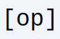
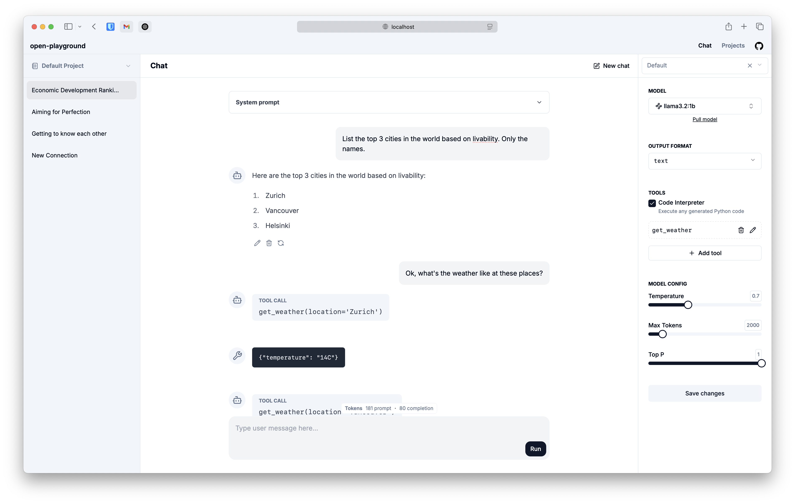

<div align="center">
    
</div>

# open-playground

Experiment with local/hosted LLMs. Build datasets for fine-tuning, benchmarking, and more.



# What's in the box?

A playground that gives you full control over the contents of a chat conversation: add, remove and edit messages (system, user and assistant) and shape the flow of the conversation to be exactly what you need. This flexibility allows you to do some interesting things, such as:
1. Start a conversation with a large reasoning model, and then switch over to a smaller model that will now mimic the reasoning steps in the previous conversations (in-context learning)
2. Provide a prefix for the model's response, nudging it in a desired direction.
3. Other things that I haven't thought of yet.

You also get some nice-to-have features:
1. Support for specifying tools for function calling.
2. A basic code interpreter implementation that can execute Python code.
3. The ability to mark conversations as "golden" and use them as few-shot examples to generate even more good conversations - which can then be used to fine-tune (coming soon).
4. Save and load preset model configs.

## Getting Started

You can run **open-playground** locally using Docker.

The playground uses [ollama](https://ollama.com) to interact with local LLMs. Support for proprietary, hosted models is coming soon.

### I already have ollama running

If you already have ollama running on your machine, you can spin up an instance of the playground with:

```bash
# Create db file to persist data outside the container
touch playground.db

docker run \
    --name open-playground \
    --add-host=host.docker.internal:host-gateway \
    -p 3000:3000 \
    -e OLLAMA_HOST=http://host.docker.internal:11434 \ # Assuming ollama is running on port 11434
    -v ./playground.db:/app/playground.db \
    ghcr.io/prvnsmpth/open-playground:latest
```

and then go to http://localhost:3000.

### I don't have ollama running

You can run the playground with ollama using Docker Compose:

```bash
git clone https://github.com/prvnsmpth/open-playground.git
cd open-playground

# If you have an nvidia GPU:
docker compose -f compose.yaml -f compose.gpu.yaml up -d

# If you don't
docker compose up -d
```

and once again, the playground is served at http://localhost:3000.

# Why

I built this for myself while experimenting with local LLMs, trying to generate data for fine-tuning them to perform specific tasks.

Small, local models have shown great promise, e.g., [deepscaler:1.5b achieves o1-preview level performance](https://pretty-radio-b75.notion.site/DeepScaleR-Surpassing-O1-Preview-with-a-1-5B-Model-by-Scaling-RL-19681902c1468005bed8ca303013a4e2). It stands to reason that these models can also be trained to perform other specific, narrow tasks - e.g., making use of an API to take actions on various apps. If we can produce a high-quality training dataset of (user query, expected API request) pairs, we might be able to build an "AI agent" fine-tuned to that specific app.

This project aims to help with the first step in this endeavor - generating high-quality training data. The eventual goal is to be able to hand-craft a few good examples using the playground, and then have local models use them as few-shot examples to generate more training data.
